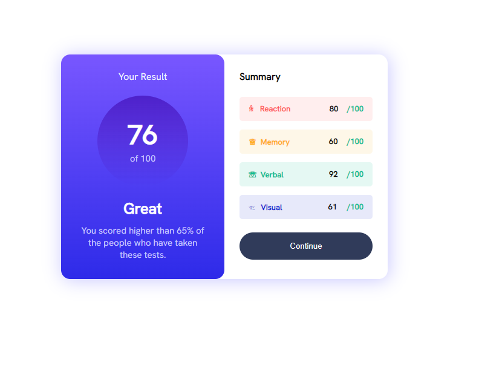

# Frontend Mentor - Results summary component solution

This is a solution to the [Results summary component challenge on Frontend Mentor](https://www.frontendmentor.io/challenges/results-summary-component-CE_K6s0maV). Frontend Mentor challenges help you improve your coding skills by building realistic projects. 

## Table of contents

- [Overview](#overview)
  - [The challenge](#the-challenge)
  - [Screenshot](#screenshot)
  - [Links](#links)
- [My process](#my-process)
  - [Built with](#built-with)
  - [What I learned](#what-i-learned)
- [Author](#author)

**Note: Delete this note and update the table of contents based on what sections you keep.**

## Overview

### The challenge

Users should be able to:

- View the optimal layout for the interface depending on their device's screen size
- See hover and focus states for all interactive elements on the page

### Screenshot

### Links

- [Solution URL](https://github.com/Melchor16/ResultSummary)
- [Live Site URL](https://melchor16.github.io/ResultSummary/)

## My process

### Built with

- Semantic HTML5 markup
- CSS custom properties
- Flexbox

### What I learned

I learn more about flexbox and how in some situations is better to use flexbox instead of css grid, this was a really good practice to refresh my knowlege of CSS

## Author

- Website - [Erick Melchor](https://github.com/Melchor16/ResultSummary)
- Frontend Mentor - [@melchor16](https://www.frontendmentor.io/profile/Melchor16)

